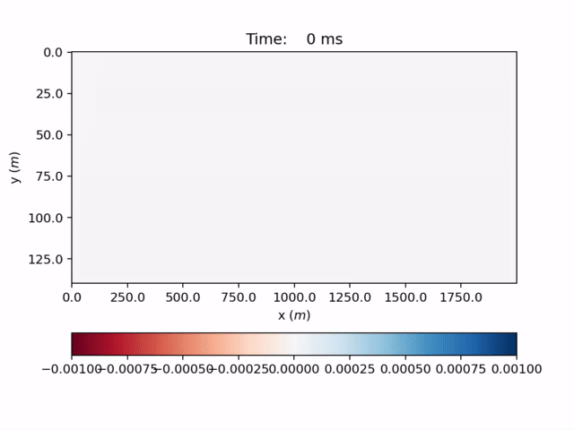
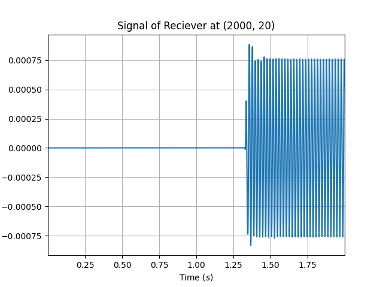
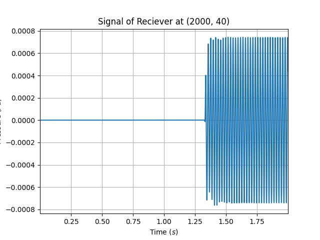
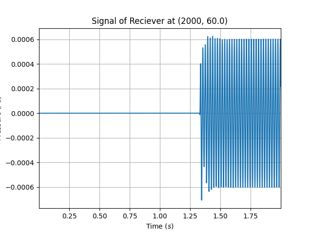

# FDTD Acoustics

## Introduction

This repository contains GPU based Finite Difference Time Domain implemented in Python3. The goal is to compute the pressure and the velocity field of acoustic waves in different viscoelastics mediums such as we could have in underwater environments.

## Running the code

The solver is in `src/FDTD_solver.py` and a description file is available in `src/Proteus.py`.

> :warning: The architecture of this repository including module organization and naming schemes are likely to evolve in the near future

## Examples

Here are some results we could get by creating a scene and by launching the solver. The animation shows the pressure field in the scene. An acoustic source is set at (0, 20) meters and 3 hydrophones are set at (2000, [20, 40, 60]) meters. Then the scene is filled with water, and there is 20 meters of sediments over 20 meters of basalt at the bottom of this sea modelization which causes celerity and viscoelasticity ruptures in the pressure field. Finally, there is reflection at the top of the scene to simulate the surface reflection of acoustic waves, and attenuation at other scene borders to avoid wave reflections.

    

| Hydrophone at (2000, 20) | Hydrophone at (2000, 40) | Hydrophone at (2000, 60) |
|:------------------------:|:------------------------:|:------------------------:|
|  |  |  |